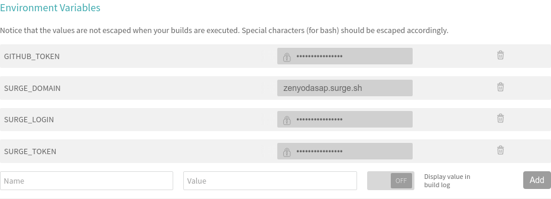

# Zen Yoda Starter Kit [](https://www.paypal.me/HaoZeke/) [](https://travis-ci.org/HaoZeke/docuYoda)  

> Copyright (C) 2017  Rohit Goswami <rohit1995@mail.ru>


This is the template for docuYoda rapid protoyping for academic documents.
The template comes with **batteries included** as it includes the dependencies for complete offline use. 

Both pandoc style citations and traditional TeX citations are enabled, however keep in mind that TeX citations will not display in non-TeX files.

Read about the project at it's source [here](https://www.github.com/HaoZeke/docuYoda) or on the documentation site [here](https://docuyoda.surge.sh).

For creating presentations, refer to the sibling project, [zenYoda](http://zenyoda.surge.sh/) and it's [starter template](http://zenyodasap.surge.sh/).

## Folder Structure
The configuration for each file is done by `yaml` files in `src/config`.
The gulp tasks exposed will handle appending these configurations in the form of frontmatter.

**DO NOT** add any frontmatter in the `.md` files.
Instead add global frontmatter to the `src/config/commonConf.yml` file.

**DO NOT** add frontmatter delimiters to **ANY** of the configuration `yml` files either, the gulp tasks will handle those.

The pdfs are eventually generated by latexmk so the configuration file is present in `src/tex`. Typically this does not need to be edited, however, depending on the requirements feel free to change the options there.

## Gulp Tasks


## Usage

### PaaS
Simply fork the repo.


Edit the content slides in `src/md/*.md`, along with references in `src/refs.bib` and also the appropriate configuration files in `src/config/` using any of the following:

- Github Native Editor
- [StackEdit](https://stackedit.io)
- [Dillinger](https://dillinger.io)
- [Prose.io](http://prose.io)

You may use any of the pandoc markdown syntax, even if the viewers above do not support the entire syntax


You'll need to edit the [Travis CI Settings](https://travis-ci.org/) for the repo as shown below:



- The first build WILL TAKE around ~20 minutes.
- Subsequent builds will only take around ~10 minutes or less.
- It's best to setup the CI immediately on forking the repository, then start working.

### Local

Simply clone the repo and start changing slideConf.yml and slides.md

You can enable file watching by:

```bash
# Runs the monitor and automatically rebuilds on changes
tup monitor -a
# Stop the monitor
tup stop
```

For automatic reloading, get [browsersync](https://browsersync.io) and run the following in another terminal:

```bash
# Get browsersync
yarn global add browser-sync
# Get live reloading
browser-sync start -s 'sap' -f 'sap'
```

The output is basically a SAP whoich may be deployed to Travis for posterity. (check the [project docs](https://zenyoda.surge.sh))

Point your browser to [the application](localhost:3000).

For using Travis, change the site name in Travis. (more in the docs)

## Acknowledgments
This software is built on the following:

- [Pandoc](https://github.com/jgm/pandoc)
- [TeX](https://ctan.org/)
- [tup](http://gittup.org/tup/index.html)
- [Metropolis](https://github.com/matze/mtheme)
- [latexmk](http://mg.readthedocs.io/latexmk.html)
- [shx](https://github.com/shelljs/shx)
- [browsersync](https://browsersync.io)
- [yarn](https://yarnpkg.com/en/)

Additionally, for the site the following tools were used:

- [sassc](https://github.com/sass/sassc)
- [node-sass](https://github.com/sass/node-sass)
- [surge](http://surge.sh)
- [panflute](http://scorreia.com/software/panflute/)
- [imagemin-cli](https://github.com/imagemin/imagemin-cli)

The site is built with:

- [Sass](http://sass-lang.com/)
- [CSS Gird](https://developer.mozilla.org/en-US/docs/Web/CSS/CSS_Grid_Layout)
- [CSS Variables](https://developer.mozilla.org/en-US/docs/Web/CSS/Using_CSS_variables)
- [Travis CI](https://travis-ci.org)

## License
Refer to the [project license](zenyoda.surge.sh).

The project like much of pandoc itself is under the [GNU GPLv3](https://choosealicense.com/licenses/gpl-3.0/), however, please refer to the exceptions listed [here](https://github.com/jgm/pandoc/blob/master/COPYRIGHT).

<div>Icons made by <a href="http://www.freepik.com" title="Freepik">Freepik</a> from <a href="https://www.flaticon.com/" title="Flaticon">www.flaticon.com</a> is licensed by <a href="http://creativecommons.org/licenses/by/3.0/" title="Creative Commons BY 3.0" target="_blank">CC 3.0 BY</a></div>