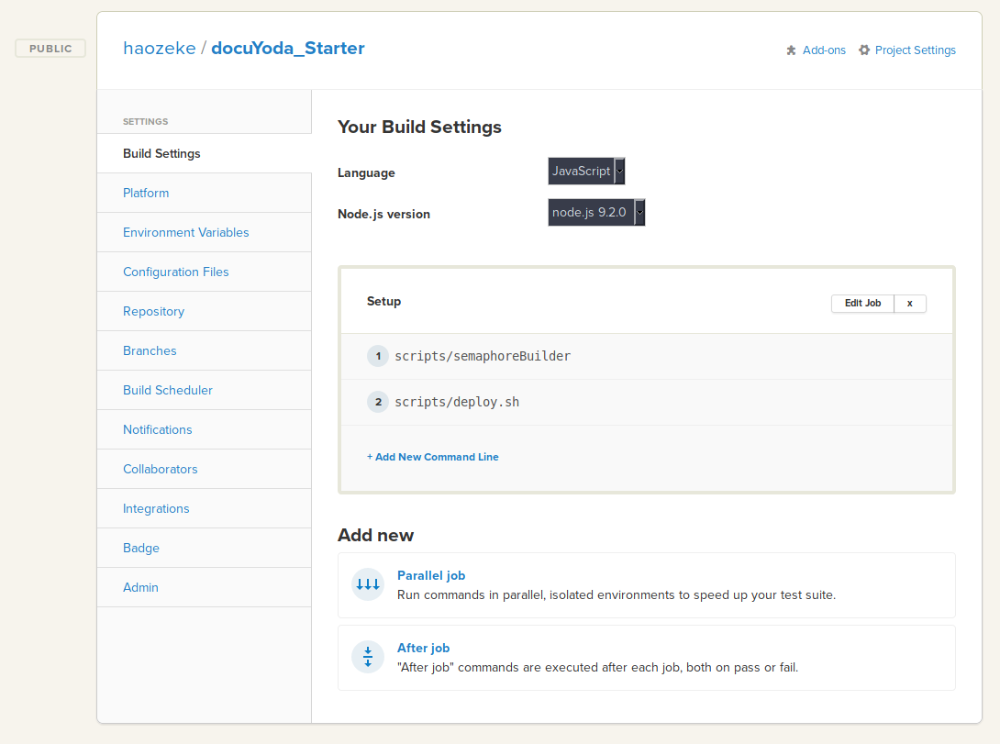

# docuYoda Starter Kit [](https://www.paypal.me/HaoZeke/) [](https://semaphoreci.com/haozeke/docuyoda_starter)

[](https://greenkeeper.io/)

> Copyright (C) 2017  Rohit Goswami <rohit1995@mail.ru>


**Check the output [here](https://github.com/HaoZeke/docuYoda_Starter/blob/pdf/spooky-action.pdf).**

This is the template for docuYoda rapid protoyping for academic documents.
The template comes with **batteries included** as it includes the dependencies for complete offline use. 

Both pandoc style citations and traditional TeX citations are enabled, however keep in mind that TeX citations will not display in non-TeX files.

Read about the project at it's source [here](https://www.github.com/HaoZeke/docuYoda) or on the documentation site [here](https://docuyoda.surge.sh).

For creating presentations, refer to the sibling project, [zenYoda](http://zenyoda.surge.sh/) and it's [starter template](http://zenyodasap.surge.sh/).


  - [Setup](#setup)
  - [Folder Structure](#folder-structure)
  - [Gulp Tasks](#gulp-tasks)
  - [Usage](#usage)
    - [Local](#local)
- [Install stuff](#install-stuff)
- [Clean and produce final pdf](#clean-and-produce-final-pdf)
  - [Acknowledgments](#acknowledgments)
  - [TO-DO](#to-do)
  - [License](#license)


## Setup
The dependencies are very light, just a full TeX distribution and yarn (with nodejs of course).

## Folder Structure
The configuration for each file is done by `yaml` files in `src/config`.
The gulp tasks exposed will handle appending these configurations in the form of frontmatter.

**DO NOT** add any frontmatter in the `.md` files.
Instead add global frontmatter to the `src/config/commonConf.yml` file.

**DO NOT** add frontmatter delimiters to **ANY** of the configuration `yml` files either, the gulp tasks will handle those.

The pdfs are eventually generated by latexmk so the configuration file is present in `src/tex`. Typically this does not need to be edited, however, depending on the requirements feel free to change the options there.

Put all images in `src/img` and refer to them with an `img/` prefix.

ie., if you have `cat.jpg` in `src/img` you would use regular markdown like so:

```markdown

```

## Gulp Tasks

```bash
# Runs the default
gulp
# Runs with production settings (clean latexmk crap)
gulp --env production
```

## Usage

### PaaS

Simply fork the repo.


Edit the content in `src/md/*.md`, along with references in `src/refs.bib` and also the appropriate configuration files in `src/config/` using any of the following:

- Github Native Editor
- [StackEdit](https://stackedit.io) *[NOT RECOMMENED] {Adds weird cruft}*
- [Dillinger](https://dillinger.io)
- [Prose.io](http://prose.io) *[recommended]*

You may use any of the pandoc markdown syntax, even if the viewers above do not support the entire syntax

[Prose.io](http://prose.io) is recommended because it's free and image support is basically drag and drop/ *[remember to ensure the path is `src/img/`]*

You'll need to edit the [Semaphore CI Settings](https://semaphoreci.com) for the repo as shown below:



- The first build WILL TAKE around ~20 minutes.
- Subsequent builds will only take around ~6 minutes or less.
- It's best to setup the CI immediately on forking the repository, then start working.


### Local

Simply clone the repo and start changing stuff!

You can enable file watching by:

```bash
# Install stuff
yarn
# Watch and reload
yarn gulp watch
# Clean and produce final pdf
yarn gulp
```

## Acknowledgments
This software is built on the following:

- [Pandoc](https://github.com/jgm/pandoc)
- [TeX](https://ctan.org/)
- [latexmk](http://mg.readthedocs.io/latexmk.html)
- [shx](https://github.com/shelljs/shx)
- [browsersync](https://browsersync.io)
- [yarn](https://yarnpkg.com/en/)

{# Additionally, for the site the following tools were used:

- [sassc](https://github.com/sass/sassc)
- [node-sass](https://github.com/sass/node-sass)
- [surge](http://surge.sh)
- [panflute](http://scorreia.com/software/panflute/)
- [imagemin-cli](https://github.com/imagemin/imagemin-cli)

The site is built with:

- [Sass](http://sass-lang.com/)
- [CSS Gird](https://developer.mozilla.org/en-US/docs/Web/CSS/CSS_Grid_Layout)
- [CSS Variables](https://developer.mozilla.org/en-US/docs/Web/CSS/Using_CSS_variables)
- [Travis CI](https://travis-ci.org)

## TO-DO
* Add site
* Add CI stuff
* Add better docs
* Improve multi-document splits
* Better error handling
* Consolidate the *Yoda tools
* Add command line arguments

## License
Refer to the [project license](zenyoda.surge.sh).

The project like much of pandoc itself is under the [GNU GPLv3](https://choosealicense.com/licenses/gpl-3.0/), however, please refer to the exceptions listed [here](https://github.com/jgm/pandoc/blob/master/COPYRIGHT).

Photo by Ksenia Makagonova on Unsplash